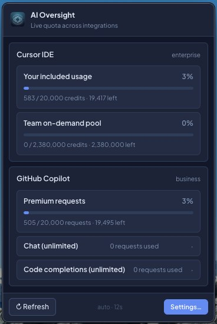

<div align="center">


# AIOversight

**The control tower for your AI coding agents.**
Know the instant an agent finishes or needs you — and never get surprised by your API bill again.

[](LICENSE)
[](#install-from-source)
[](https://www.electronjs.org/)
[](tsconfig.json)
[](#extending-aioversight)


</div>

---

You kick off Claude Code, Cursor, or Codex on a long task… and then what? You alt-tab every two minutes to check if it's done, or worse — it's been sitting there for twenty minutes waiting for *you* to approve a command.

**AIOversight** is a lightweight desktop tray app that watches your AI agents for you. It fires a native notification the moment an agent **finishes** a task or is **waiting** for your input, and keeps a live summary of your **token quotas and spend** across providers — one click away in your menu bar.

<div align="center">



</div>

## Features

- 🔔 **Instant alerts** — native desktop notifications when an agent finishes a long-running task or pauses for human approval.
- 📊 **Quota & spend tracking** — remaining credits, token usage, and billing-cycle spend for Anthropic, OpenAI, GitHub Copilot, Cursor, and Claude Code, polled on configurable intervals.
- 🔌 **Universal HTTP webhook** — one `curl` line integrates *any* agent, script, or framework that can make an HTTP request.
- 📄 **Generic JSONL watcher** — point it at any transcript file and get waiting/finished detection for custom tools.
- 🔒 **Local-first & private** — runs entirely on your machine. No cloud, no telemetry. Credentials encrypted at rest with Electron `safeStorage` (Keychain on macOS, DPAPI on Windows).
- 🪶 **Deliberately minimal** — vanilla TypeScript, two runtime dependencies, no bundler, no framework.

## Built-in connectors

| Connector | Notifications | Quota |
| --- | :---: | :---: |
| **Cursor IDE** | ✅ | ✅ |
| **Claude Code** | ✅ | ✅ |
| **Codex CLI** | ✅ | — |
| **Anthropic Console** | — | ✅ |
| **OpenAI** | — | ✅ |
| **GitHub Copilot** | — | ✅ |
| **Custom JSONL** | ✅ | — |
| **HTTP webhook** | ✅ | — |

> Don't see your tool? The [HTTP webhook](#universal-webhook) covers anything that can `POST` JSON, and [adding a first-class connector](#extending-aioversight) is a single folder.

## Quick start

```bash
git clone https://github.com/nikolmedo/AIOversight.git
cd AIOversight
npm install
npm run dev          # builds + launches Electron
```

Look for the bell icon in your menu bar (macOS) or system tray (Windows):

- **Left-click** → popup with one row per enabled quota integration plus *Open settings…*
- **Right-click** → context menu (pause / settings / quit)

Then open **Settings → Integrations** and flip on the connectors you use. That's it.

### Build distributable installers

```bash
npm run package:mac   # .dmg + .zip in release/
npm run package:win   # .exe (NSIS) + portable .exe in release/
```

> Cross-compiling for Windows from macOS requires Wine; otherwise build on each target OS.

## How it works

Each tool signals "I'm waiting on the human" or "I'm done" differently, and most don't expose a stable API for it. The shared signal that *does* exist: **the conversation log stops growing.**

AIOversight tails each agent's transcript and classifies the last line once it goes idle:

| Last line in transcript | Verdict | Notification |
| --- | --- | --- |
| Assistant turn with a pending `tool_use` block | Agent is blocked on you | `waiting` 🔶 |
| Assistant turn with text only (a final answer) | Task complete | `finished` ✅ |

Both kinds have independent on/off toggles, a per-session cooldown, and quiet hours. The idle threshold is tunable per connector.

For tools whose state can't be seen from disk (GitHub Copilot Chat in VS Code, IDE-embedded agents), the **HTTP webhook** fills the gap.

## Universal webhook

Any agent that can make an HTTP request can notify you:

```
POST http://127.0.0.1:53127/notify
Content-Type: application/json
X-AI-Oversight-Token: <token>      # only if you set one in the UI

{
  "agent":     "Copilot",                        // required
  "message":   "Allow npm install?",             // required
  "kind":      "waiting",                        // "waiting" (default) | "finished"
  "sessionId": "vscode-workspace-abc",           // optional; used for de-dup
  "title":     "Copilot wants to run a command", // optional
  "source":    "/Users/me/projects/myapp"        // optional; clicking the
                                                 // notification reveals this
                                                 // path in Finder/Explorer
}
```

Health check: `GET /health` → `{"ok":true,"service":"aioversight"}`.

The **Webhook recipe** tab in Settings generates a copy-paste `curl` example with your current host / port / token already filled in.

<details>
<summary><b>Example: Claude Code hooks (waiting + finished)</b></summary>

In `~/.claude/settings.json`:

```json
{
  "hooks": {
    "PreToolUse": [{
      "matcher": "Bash|Edit|Write",
      "hooks": [{
        "type": "command",
        "command": "curl -sX POST http://127.0.0.1:53127/notify -H 'Content-Type: application/json' -d '{\"agent\":\"Claude Code\",\"kind\":\"waiting\",\"message\":\"Tool approval requested\"}' >/dev/null"
      }]
    }],
    "Stop": [{
      "hooks": [{
        "type": "command",
        "command": "curl -sX POST http://127.0.0.1:53127/notify -H 'Content-Type: application/json' -d '{\"agent\":\"Claude Code\",\"kind\":\"finished\",\"message\":\"Turn complete\"}' >/dev/null"
      }]
    }]
  }
}
```

</details>

<details>
<summary><b>Example: shell wrapper for any CLI agent (fires <code>finished</code> on exit)</b></summary>

```bash
#!/usr/bin/env bash
# Wrap any CLI agent so its OS-process exit fires a "finished" notification.
# Usage: ./watch-exit.sh claude --resume my-session
agent="$1"; shift
"$agent" "$@"
status=$?
curl -sX POST http://127.0.0.1:53127/notify \
  -H "Content-Type: application/json" \
  -d "{\"agent\":\"$agent\",\"kind\":\"finished\",\"message\":\"exited with status $status\"}"
```

</details>

## Settings at a glance

| Tab | What you'll find |
| --- | --- |
| **Integrations** | One card per connector, grouped by vendor, with independent **Notifications** / **Quota** toggles. Secret fields are masked and encrypted at rest. |
| **Recent events** | Last 50 fired notifications with a `waiting` / `finished` pill and source file. |
| **Logs** | Diagnostic output from each connector, the runtime, and the notifier. |
| **General** | Launch at system startup, master notification switch, per-kind toggles, cooldown, default quota poll interval, tray quota summary, quiet hours. |
| **Webhook recipe** | Copy-paste `curl` example with your live host / port / token. |

## Privacy & security

- **Everything stays local.** No cloud service, no telemetry, no account.
- API keys, cookies, and PATs are encrypted with Electron's `safeStorage` (Keychain on macOS, DPAPI on Windows) and stored in `secrets.json`, separate from `settings.json` — which never contains credentials.
- Secrets never reach the UI process: the renderer can write a secret but can never read one back.

Settings live in the OS-standard userData directory:

- macOS: `~/Library/Application Support/AI Oversight/{settings,secrets}.json`
- Windows: `%APPDATA%/AI Oversight/{settings,secrets}.json`

## Development

```bash
npx tsc --noEmit      # type-check (strict mode is the linter)
npm test              # unit test suite (node:test, zero extra deps)
npm run smoke         # headless end-to-end tests (no Electron required)
npm run dev           # build + launch Electron
```

The codebase is plain TypeScript compiled with `tsc` — no bundler, no UI framework, and only two runtime dependencies (`chokidar`, `sql.js`). See [CLAUDE.md](CLAUDE.md) for the full architecture overview and contribution conventions.

## Extending AIOversight

A connector is **a single self-contained folder** — declare it, register it once, done. The settings UI auto-discovers its card from `configSchema`; the runtime, notifier, and quota poller pick it up generically.

```
src/main/connectors/xyz/
  index.ts        # default-exports a Connector definition
  detector.ts     # uses TranscriptWatcher with an extractStatus heuristic
  quota.ts        # optional: returns a QuotaProvider
```

```ts
// index.ts — minimum viable notifications-only connector
const XyzConnector: Connector = {
  id: 'xyz',
  name: 'XYZ Agent',
  vendor: 'XYZ Inc.',
  description: 'Watches XYZ transcripts for waiting / finished turns.',
  enabledByDefault: false,
  configSchema: [
    { key: 'paths', label: 'Transcript paths', type: 'paths',
      section: 'notifications', requiresEnabled: 'notifications', default: [] },
    { key: 'idleSeconds', label: 'Idle threshold (seconds)', type: 'number',
      section: 'notifications', requiresEnabled: 'notifications', default: 6 },
  ],
  detector: { create: createXyzDetector },
};
```

Then add it to `ALL_CONNECTORS` in `src/main/connectors/registry.ts`. The full authoring guide — including quota providers, secrets, and login flows — lives in [`src/main/connectors/README.md`](src/main/connectors/README.md).

## License

[Apache License 2.0](LICENSE)
