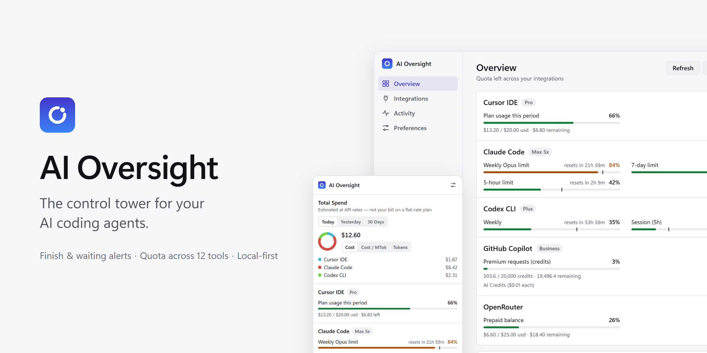
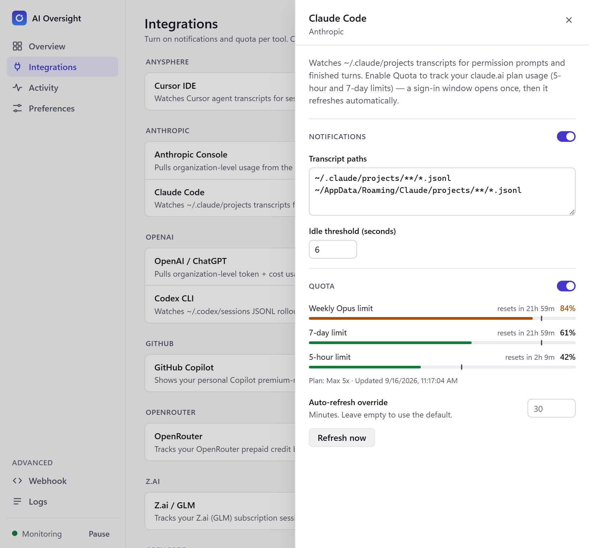
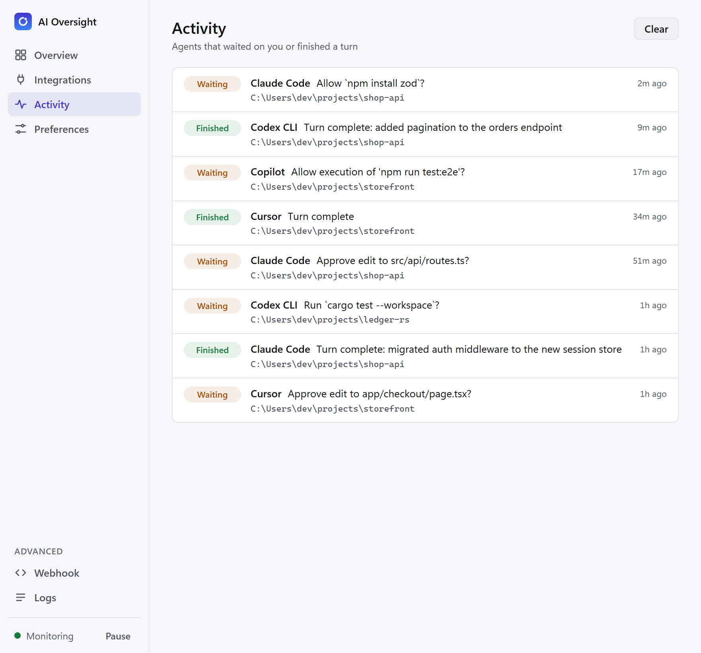
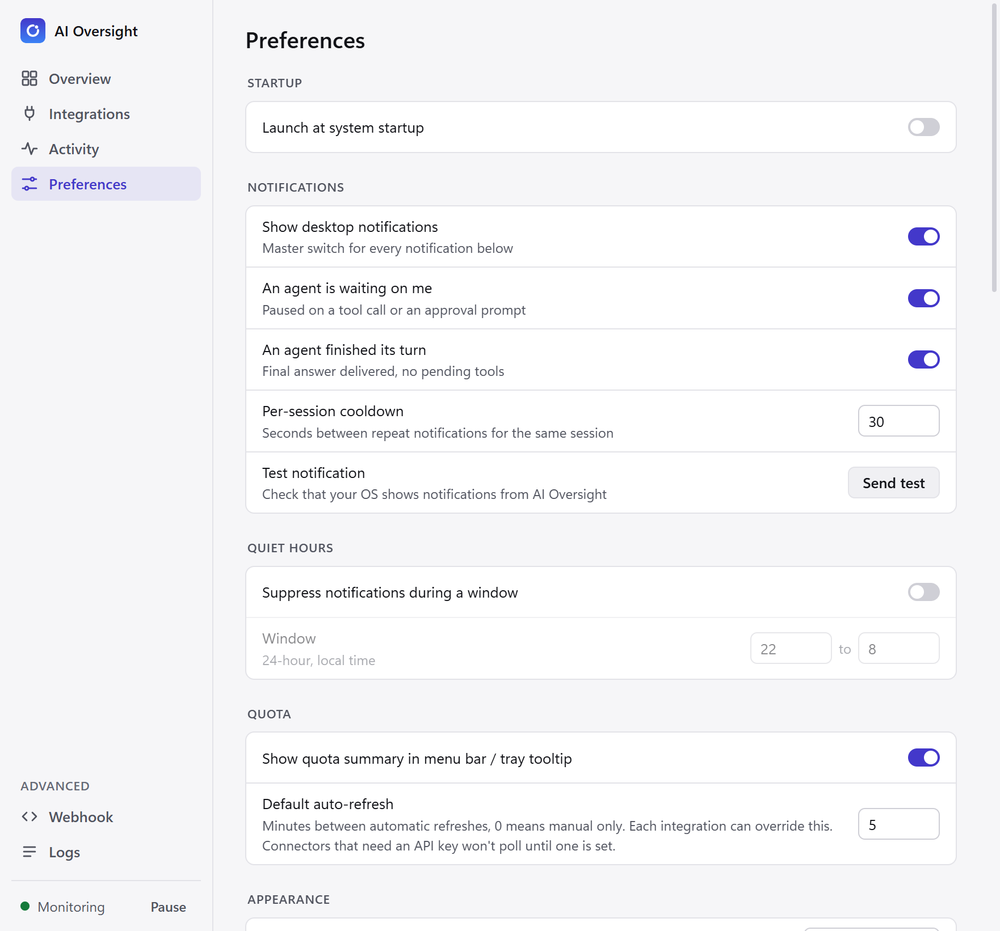
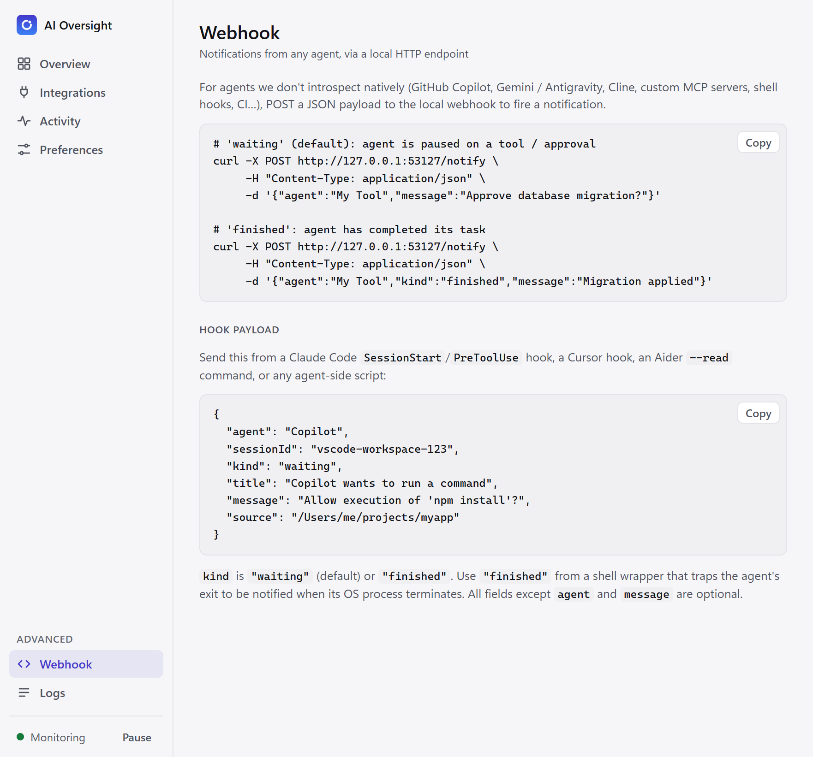
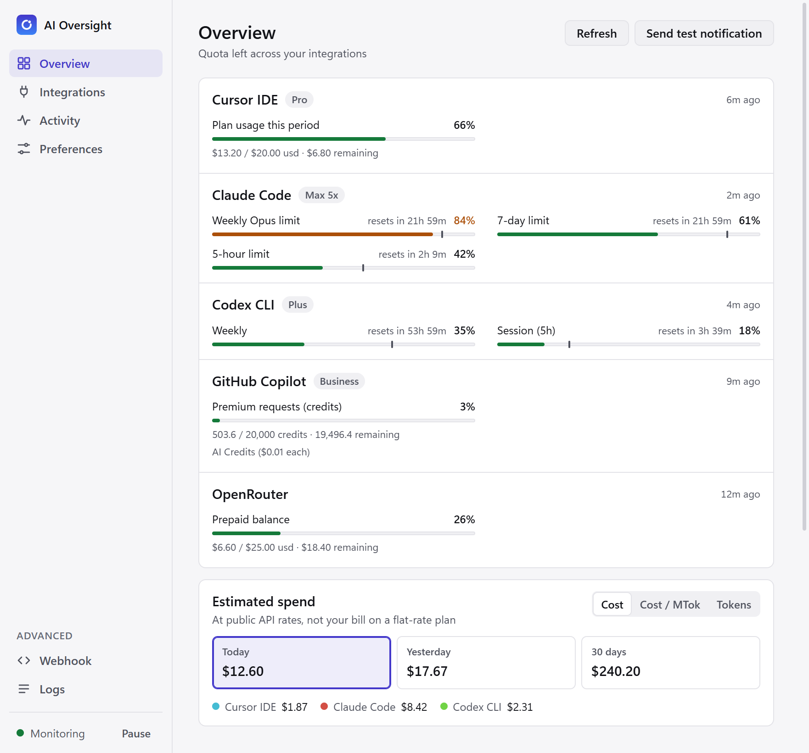
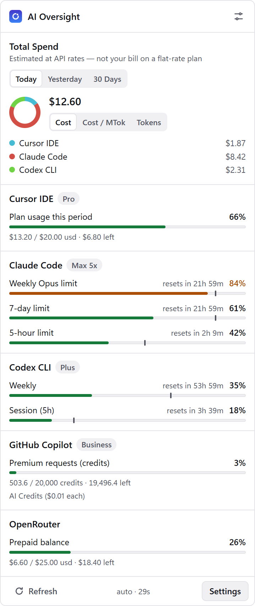

<picture>
  <source media="(prefers-color-scheme: dark)" srcset="docs/cover-dark.png">
  
</picture>

<div align="center">

[](LICENSE)
[](#quick-start)
[](https://www.electronjs.org/)
[](tsconfig.json)

[Features](#features) · [Screenshots](#screenshots) · [Connectors](#built-in-connectors) · [Quick start](#quick-start) · [How it works](#how-it-works) · [Webhook](#universal-webhook) · [Development](#development)

</div>

---

You start Claude Code, Cursor, or Codex on a long task, and then what? You alt-tab every two minutes to check whether it's done, or it sits for twenty minutes waiting for *you* to approve a command.

**AI Oversight** is a lightweight tray app that watches your agents for you. It sends a native notification the moment an agent **finishes** or is **waiting** for your input, and keeps a live summary of your **token quotas and spend** across providers, one click away in the menu bar or system tray.

## Features

- **Instant alerts.** Native desktop notifications when an agent finishes a long-running task or pauses for approval.
- **Quota and spend tracking.** Remaining credits, token usage, and billing-cycle spend for Claude Code, Codex CLI, Cursor, GitHub Copilot, OpenRouter and more, polled on configurable intervals.
- **Universal HTTP webhook.** One `curl` line integrates any agent, script, or framework that can make an HTTP request.
- **Generic JSONL watcher.** Point it at any transcript file to get waiting/finished detection for custom tools.
- **Local-first and private.** Runs entirely on your machine: no cloud, no telemetry. Credentials are encrypted at rest with Electron `safeStorage` (Keychain on macOS, DPAPI on Windows).
- **Deliberately minimal.** Vanilla TypeScript, two runtime dependencies, no bundler, no framework.

## Screenshots

<table>
  <tr>
    <td width="50%" align="center">
      <picture>
        <source media="(prefers-color-scheme: dark)" srcset="docs/screenshots/integrations-drawer-dark.png">
        
      </picture>
      <br><sub>Integrations, with a connector's detail drawer</sub>
    </td>
    <td width="50%" align="center">
      <picture>
        <source media="(prefers-color-scheme: dark)" srcset="docs/screenshots/activity-dark.png">
        
      </picture>
      <br><sub>Activity</sub>
    </td>
  </tr>
  <tr>
    <td width="50%" align="center">
      <picture>
        <source media="(prefers-color-scheme: dark)" srcset="docs/screenshots/preferences-dark.png">
        
      </picture>
      <br><sub>Preferences</sub>
    </td>
    <td width="50%" align="center">
      <picture>
        <source media="(prefers-color-scheme: dark)" srcset="docs/screenshots/webhook-dark.png">
        
      </picture>
      <br><sub>Advanced → Webhook</sub>
    </td>
  </tr>
  <tr>
    <td width="50%" align="center">
      <picture>
        <source media="(prefers-color-scheme: dark)" srcset="docs/screenshots/overview-dark.png">
        
      </picture>
      <br><sub>Overview</sub>
    </td>
    <td width="50%" align="center">
      <picture>
        <source media="(prefers-color-scheme: dark)" srcset="docs/screenshots/popup-dark.png">
        
      </picture>
      <br><sub>Tray popup</sub>
    </td>
  </tr>
</table>

## Built-in connectors

| Connector | Notifications | Quota |
| --- | :---: | :---: |
| **Cursor IDE** | ✅ | ✅ |
| **Anthropic Console** | — | ✅ |
| **Claude Code** | ✅ | ✅ \* |
| **OpenAI / ChatGPT** | — | ✅ |
| **Codex CLI** | ✅ | ✅ |
| **GitHub Copilot** | — | ✅ \* |
| **OpenRouter** | — | ✅ |
| **Z.ai / GLM** | — | ✅ |
| **OpenCode** | — | ✅ |
| **Grok CLI** | — | ✅ |
| **Devin** | — | ✅ |
| **Antigravity** | — | ✅ |
| **Custom JSONL transcripts** | ✅ | — |
| **HTTP webhook (universal)** | ✅ | — |

<sub>\* Has an in-app sign-in button. Claude Code quota tracks your claude.ai plan usage through a browser session you sign into once; GitHub Copilot can also reuse an existing VS Code Copilot Chat or `gh` CLI session.</sub>

> [!TIP]
> Don't see your tool? The [HTTP webhook](#universal-webhook) covers anything that can `POST` JSON, and [adding a first-class connector](#extending-ai-oversight) takes a single folder.

## Quick start

```bash
git clone https://github.com/nikolmedo/AIOversight.git
cd AIOversight
npm install
npm run dev          # builds + launches Electron
```

Look for the ring icon in your menu bar (macOS) or system tray (Windows):

- **Left-click** opens the popup: estimated spend and quota meters for every enabled integration, plus a *Settings* button.
- **Right-click** opens the context menu: pause, settings, test notification, quit.

Then open **Settings → Integrations** and turn on the connectors you use.

### Build distributable installers

```bash
npm run package:mac   # .dmg + .zip in release/
npm run package:win   # .exe (NSIS) + portable .exe in release/
npm run package:linux # AppImage + .deb + .tar.gz in release/
```

> [!NOTE]
> Cross-compiling for Windows from macOS requires Wine; otherwise build on each target OS.

## How it works

Each tool signals "I'm waiting on the human" or "I'm done" differently, and most don't expose a stable API for it. The signal they all share: **the conversation log stops growing.**

AI Oversight tails each agent's transcript and classifies the last line once it goes idle:

| Last line in transcript | Verdict | Notification |
| --- | --- | --- |
| Assistant turn with a pending `tool_use` block | Agent is blocked on you | `waiting` |
| Assistant turn with text only (a final answer) | Task complete | `finished` |

Both kinds have independent on/off toggles, a per-session cooldown, and quiet hours. The idle threshold is tunable per connector.

For tools whose state can't be seen from disk (GitHub Copilot Chat in VS Code, IDE-embedded agents), the **HTTP webhook** fills the gap.

## Universal webhook

Any agent that can make an HTTP request can notify you:

```
POST http://127.0.0.1:53127/notify
Content-Type: application/json
X-AI-Oversight-Token: <token>      # only if you set one in the UI

{
  "agent":     "Copilot",                        // optional; default "External agent"
  "message":   "Allow npm install?",             // optional; default depends on kind
  "kind":      "waiting",                        // "waiting" (default) | "finished"
  "sessionId": "vscode-workspace-abc",           // optional; used for de-dup and cooldown
  "title":     "Copilot wants to run a command", // optional
  "source":    "/Users/me/projects/myapp"        // optional; clicking the
                                                 // notification reveals this
                                                 // path in Finder/Explorer
}
```

Health check: `GET /health` → `{"ok":true,"service":"aioversight"}`.

The **Webhook** page in Settings (under *Advanced*) generates a copy-paste `curl` example with your current host, port, and token filled in.

<details>
<summary><b>Example: Claude Code hooks (waiting + finished)</b></summary>

In `~/.claude/settings.json`:

```json
{
  "hooks": {
    "PreToolUse": [{
      "matcher": "Bash|Edit|Write",
      "hooks": [{
        "type": "command",
        "command": "curl -sX POST http://127.0.0.1:53127/notify -H 'Content-Type: application/json' -d '{\"agent\":\"Claude Code\",\"kind\":\"waiting\",\"message\":\"Tool approval requested\"}' >/dev/null"
      }]
    }],
    "Stop": [{
      "hooks": [{
        "type": "command",
        "command": "curl -sX POST http://127.0.0.1:53127/notify -H 'Content-Type: application/json' -d '{\"agent\":\"Claude Code\",\"kind\":\"finished\",\"message\":\"Turn complete\"}' >/dev/null"
      }]
    }]
  }
}
```

</details>

<details>
<summary><b>Example: shell wrapper for any CLI agent (fires <code>finished</code> on exit)</b></summary>

```bash
#!/usr/bin/env bash
# Wrap any CLI agent so its OS-process exit fires a "finished" notification.
# Usage: ./watch-exit.sh claude --resume my-session
agent="$1"; shift
"$agent" "$@"
status=$?
curl -sX POST http://127.0.0.1:53127/notify \
  -H "Content-Type: application/json" \
  -d "{\"agent\":\"$agent\",\"kind\":\"finished\",\"message\":\"exited with status $status\"}"
```

</details>

## Settings at a glance

The settings window has a sidebar with four main pages and an **Advanced** group:

| Page | What you'll find |
| --- | --- |
| **Overview** | Quota meters for every integration with quota tracking on (pace coloring and reset countdowns), estimated spend for today / yesterday / 30 days, and the latest agent activity. |
| **Integrations** | Every connector grouped by vendor, with its status and independent **Notifications** / **Quota** switches. Click one to open its detail drawer: config fields, live quota meters, auto-refresh override, and sign-in where supported. Secret fields are masked and encrypted at rest. |
| **Activity** | The last 50 notifications, each with a `waiting` / `finished` pill, the agent, and its source path. |
| **Preferences** | Startup, notifications (master switch, per-kind toggles, cooldown, test), quiet hours, quota polling and tray summary, appearance (theme, density, time format, estimated spend), tray popup (transparency, global shortcut), and display (show, star, and reorder usage meters). |
| **Advanced → Webhook** | Copy-paste `curl` example with your live host, port, and token, plus a sample hook payload. |
| **Advanced → Logs** | Diagnostic output from each connector, the runtime, and the notifier. |

## Privacy & security

- **Everything stays local.** No cloud service, no telemetry, no account.
- **Credentials are encrypted.** API keys, cookies, and PATs are encrypted with Electron's `safeStorage` (Keychain on macOS, DPAPI on Windows) and stored in `secrets.json`, separate from `settings.json`, which never contains credentials.
- **Secrets never reach the UI process.** The renderer can write a secret but can never read one back.

Settings live in the OS-standard userData directory:

- macOS: `~/Library/Application Support/AI Oversight/{settings,secrets}.json`
- Windows: `%APPDATA%/AI Oversight/{settings,secrets}.json`

## Development

```bash
npx tsc --noEmit      # type-check (strict mode is the linter)
npm test              # unit test suite (node:test, zero extra deps)
npm run smoke         # headless end-to-end tests (no Electron required)
npm run dev           # build + launch Electron
```

The codebase is plain TypeScript compiled with `tsc`: no bundler, no UI framework, and only two runtime dependencies (`chokidar`, `sql.js`). See [CLAUDE.md](CLAUDE.md) for the architecture overview and conventions, and [CONTRIBUTING.md](CONTRIBUTING.md) before opening a pull request.

## Extending AI Oversight

A connector is **a single self-contained folder**: declare it, register it once, done. The settings UI builds its card from `configSchema`, and the runtime, notifier, and quota poller pick it up generically.

```
src/main/connectors/xyz/
  index.ts        # default-exports a Connector definition
  detector.ts     # uses TranscriptWatcher with an extractStatus heuristic
  quota.ts        # optional: returns a QuotaProvider
```

```ts
// index.ts — minimum viable notifications-only connector
const XyzConnector: Connector = {
  id: 'xyz',
  name: 'XYZ Agent',
  vendor: 'XYZ Inc.',
  description: 'Watches XYZ transcripts for waiting / finished turns.',
  enabledByDefault: false,
  configSchema: [
    { key: 'paths', label: 'Transcript paths', type: 'paths',
      section: 'notifications', requiresEnabled: 'notifications', default: [] },
    { key: 'idleSeconds', label: 'Idle threshold (seconds)', type: 'number',
      section: 'notifications', requiresEnabled: 'notifications', default: 6 },
  ],
  detector: { create: createXyzDetector },
};
```

Then add it to `ALL_CONNECTORS` in `src/main/connectors/registry.ts`. The full authoring guide, including quota providers, secrets, and login flows, lives in [`src/main/connectors/README.md`](src/main/connectors/README.md).

## License

[Apache License 2.0](LICENSE)
